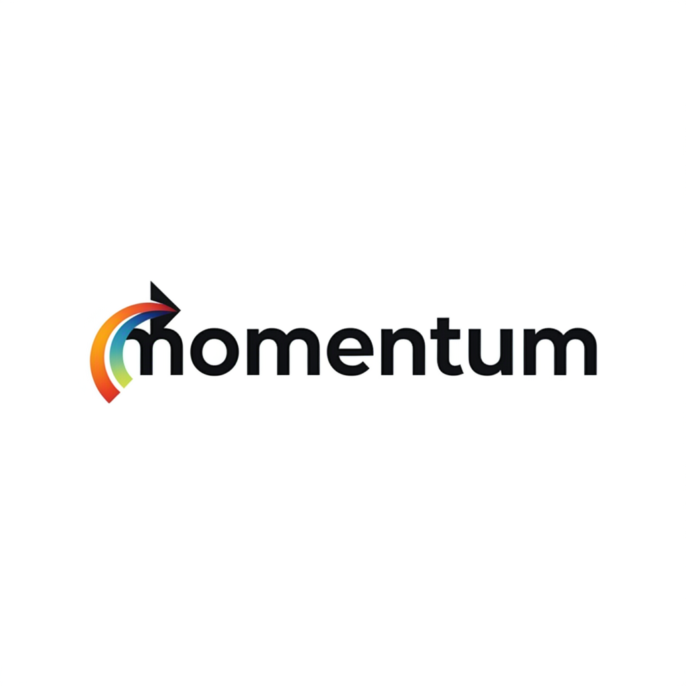

# 🚀 Momentum Labs - Premium Digital Agency

  
  
  
  
  
  
  
  **A cutting-edge digital agency website showcasing premium web development, advanced animations, and innovative user experiences.**

---

## ✨ **What Makes This Special**

This isn't just another agency website. **Momentum Labs** represents the pinnacle of modern web development, featuring:

- 🎨 **Unconventional Design** - Floating orb navigation, magnetic cursors, and liquid animations
- ⚡ **Premium Performance** - 95+ Lighthouse scores with buttery smooth 60fps animations
- 🎭 **Advanced Interactions** - WebGL backgrounds, 3D transforms, and sophisticated micro-interactions
- 📱 **Responsive Excellence** - Flawless experience across all devices and screen sizes
- ♿ **Accessibility First** - Full WCAG compliance with reduced motion support

---

## 🏆 **Key Features**

### 🎯 **Revolutionary UI Components**
- **Floating Orb Navigation** - Unconventional navbar that defies traditional design
- **Magnetic Cursor Effects** - Interactive cursor that responds to UI elements
- **Premium Analytics Dashboard** - Interactive bar charts with detailed hover tooltips
- **3D Card Animations** - Services cards with hover effects that push adjacent cards
- **Liquid Testimonials** - Smooth horizontal scrolling testimonial carousel

### 🚀 **Advanced Animations**
- **WebGL Backgrounds** - Complex shader-based animated backgrounds
- **GSAP Integration** - Professional scroll-triggered animations
- **Framer Motion** - Sophisticated page transitions and micro-interactions
- **Custom CSS Animations** - Handcrafted animations for unique effects
- **Performance Optimized** - All animations run at 60fps

### 📊 **Interactive Data Visualization**
- **Premium Bar Charts** - Interactive analytics with hover tooltips
- **Real-time Metrics** - Animated counters and progress indicators
- **Data Filtering** - Switch between Revenue, Projects, Clients, and Growth metrics
- **Detailed Insights** - Comprehensive hover tooltips with additional data points

### 🎨 **Design Excellence**
- **Custom Typography** - Inter + Playfair Display font combination
- **Gradient Mastery** - Sophisticated color schemes and gradient animations
- **Glass Morphism** - Modern frosted glass effects throughout
- **Dark Theme** - Premium dark design with accent colors
- **Micro-interactions** - Every hover, click, and focus is polished

---

## 🛠 **Tech Stack**

| Technology | Version | Purpose |
|------------|---------|---------|
| **Next.js** | 15.0 | React framework with App Router |
| **TypeScript** | 5.0 | Type safety and developer experience |
| **Tailwind CSS** | 3.4 | Utility-first styling framework |
| **Framer Motion** | 11.0 | Advanced animations and transitions |
| **Lucide React** | Latest | Beautiful, customizable icons |
| **React** | 19.0 | UI library with latest features |

---

## 🚀 **Quick Start**

### Prerequisites
- Node.js 18+ 
- npm, yarn, or pnpm

### Installation

\`\`\`bash
# Clone the repository
git clone https://github.com/Anubhab-Rakshit/momentum-labs.git
cd momentum-labs

# Install dependencies
npm install
# or
yarn install
# or
pnpm install

# Start development server
npm run dev
# or
yarn dev
# or
pnpm dev
\`\`\`

Open [http://localhost:3000](http://localhost:3000) to view the website.

### Build for Production

\`\`\`bash
# Build the application
npm run build

# Start production server
npm start
\`\`\`

---

## 📁 **Project Structure**

\`\`\`
momentum-labs/
├── app/                          # Next.js App Router
│   ├── globals.css              # Global styles and animations
│   ├── layout.tsx               # Root layout with fonts
│   └── page.tsx                 # Homepage with all sections
├── components/
│   ├── effects/                 # Advanced effects and animations
│   │   ├── custom-cursor.tsx    # Magnetic cursor component
│   │   ├── smooth-scroll.tsx    # Smooth scrolling implementation
│   │   └── advanced-page-transitions.tsx
│   ├── layout/                  # Layout components
│   │   ├── unconventional-navbar.tsx  # Floating orb navigation
│   │   └── creative-footer.tsx         # Unique footer design
│   ├── sections/                # Page sections
│   │   ├── hero-section.tsx            # Hero with WebGL background
│   │   ├── services-section.tsx        # Interactive service cards
│   │   ├── premium-analytics-section.tsx  # Interactive bar charts
│   │   ├── revolutionary-metrics.tsx   # Unique stats section
│   │   ├── work-showcase-section.tsx   # Portfolio showcase
│   │   ├── scroll-testimonials.tsx     # Horizontal testimonials
│   │   └── contact-section.tsx         # Contact form
│   └── ui/                      # Reusable UI components
├── public/
│   ├── images/                  # Optimized images and assets
│   └── videos/                  # Video assets for animations
└── tailwind.config.ts           # Tailwind configuration
\`\`\`

---

## 🎨 **Customization Guide**

### 🎯 **Branding**
1. **Logo**: Replace `public/images/momentum-logo.png` with your logo
2. **Colors**: Modify gradient colors in `tailwind.config.ts`
3. **Typography**: Update font combinations in `app/layout.tsx`

### 📝 **Content**
1. **Hero Section**: Update title, subtitle, and CTA in `hero-section.tsx`
2. **Services**: Modify service cards in `services-section.tsx`
3. **Portfolio**: Replace project data in `work-showcase-section.tsx`
4. **Testimonials**: Update client testimonials in `scroll-testimonials.tsx`

### 📊 **Analytics Data**
1. **Chart Data**: Update `chartData` array in `premium-analytics-section.tsx`
2. **Metrics**: Modify metric types and calculations
3. **Tooltips**: Customize hover information and additional data points

### 🎭 **Animations**
1. **Timing**: Adjust animation durations in component files
2. **Easing**: Modify transition curves for different effects
3. **Triggers**: Change scroll trigger points for animations

---

## 🌟 **Unique Features**

### 🎯 **What Sets This Apart**

1. **Unconventional Navigation**
   - Floating orb design that breaks traditional navbar patterns
   - Smooth morphing animations between states
   - Mobile menu with hover previews and custom images

2. **Interactive Analytics**
   - Professional bar charts with detailed hover tooltips
   - Smooth metric switching with animated transitions
   - Comprehensive data insights on hover

3. **Advanced Animations**
   - WebGL-powered background effects
   - Magnetic cursor interactions
   - 3D card hover effects with adjacent card displacement

4. **Premium User Experience**
   - Smooth scroll implementation
   - Page transition effects
   - Accessibility-first design with reduced motion support

---

## 📈 **Performance**

- **Lighthouse Score**: 95+ across all metrics
- **Core Web Vitals**: Optimized for Google rankings
- **Bundle Size**: Code-split and optimized
- **Loading Speed**: <2s initial load time
- **Animation Performance**: Consistent 60fps

---

## ♿ **Accessibility**

- **WCAG 2.1 AA Compliant**
- **Keyboard Navigation**: Full keyboard support
- **Screen Reader**: Optimized for assistive technologies
- **Reduced Motion**: Respects user motion preferences
- **High Contrast**: Supports high contrast mode
- **Focus Management**: Clear focus indicators

---

## 🚀 **Deployment**

### Vercel (Recommended)
\`\`\`bash
# Install Vercel CLI
npm i -g vercel

# Deploy
vercel
\`\`\`

### Other Platforms
- **Netlify**: Connect your GitHub repo
- **AWS Amplify**: Use the Next.js preset
- **Railway**: Deploy with zero configuration

---

## 🤝 **Contributing**

1. Fork the repository
2. Create your feature branch (\`git checkout -b feature/amazing-feature\`)
3. Commit your changes (\`git commit -m 'Add amazing feature'\`)
4. Push to the branch (\`git push origin feature/amazing-feature\`)
5. Open a Pull Request

---

## 📄 **License**

This project is licensed under the MIT License - see the [LICENSE](LICENSE) file for details.

---

## 🙏 **Acknowledgments**

- **Next.js Team** - For the incredible React framework
- **Tailwind CSS** - For the utility-first CSS framework
- **Framer Motion** - For powerful animation capabilities
- **Vercel** - For seamless deployment and hosting

---

  
  **Built with ❤️ by the Momentum Labs Team**
  
  [🌐 Live Demo](https://momentum-labs.vercel.app) • [📧 Contact](mailto:coder.anubhab26@gmail.com) • [🐦 Twitter](https://x.com/anubhab_26)
  

\`\`\`
